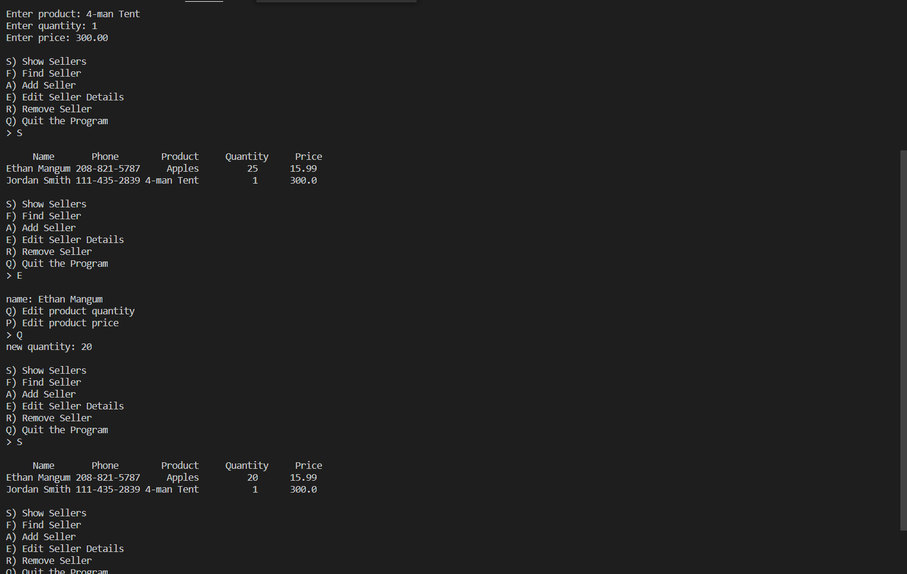

# Description  
This program demonstrates the use of SQL databases with the Python programming language. It represents an online shopping scenario where people who have products to sell can put themselves in the database. Once the table is created in the database, the user is able to add, edit, display, and remove their name, phone number, product, quantity, and price.

# Database Setup
1. create the file that the database will go into. 
2. create the connection to the database with the sqlite3.connect("[database name]") command.
3. create a cursor that allows you to access and make changes to the database.
4. Make sure that once the program finishes, that you close the connection to the database.

# Example

# Main SQL Commands
SELECT - grabs an item from the database based on given requirements
ADD - adds a new item to the database
UPDATE - changes the specified item in the database
DELETE - removes the specified item(s) from the database

# Useful Websites
[w3schools](https://www.w3schools.com/python/default.asp) - contains tutorials for Python, as well as using SQL in Python